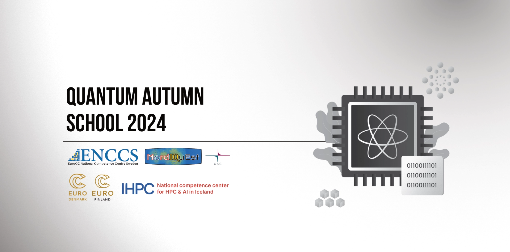

## Table of Contents
1. [Description](#description)
2. [Information](#information)
4. [Certificate](#certificate)

## Description

Recent developments in quantum technology are bringing the world closer to a new technological revolution – the advent of usable quantum computers able to provide enormous acceleration to important computational tasks. In coming years, quantum computing is expected to have a significant impact on many areas of research that can utilise computational modelling. Indeed, significant efforts and investments are currently underway in Europe to bolster skills and capacity within quantum computing.

ENCCS joins forces again this year with NordIQuEst, to deliver a three-day quantum autumn school in early December 2024! The school will also be visited by and contributed to by several companies who are developing in-house expertise in various application domains of quantum computing.

NordΙQuEst brings together a consortium of seven partners from five Nordic and Baltic countries to connect world leading traditional HPC resources and quantum computers across national borders with the aim to establish a quantum computing platform customised to the needs of the region.

## Information

The overall goals of this course were the following:
> - Overview and update on recent developments in QC software stacks.
> - Integration of QC with classical computing: hybrid classical/quantum algorithms and HPC+QC systems. 
> - QC programming in high-level languages for scientific and industrial use cases.
> - Recent developments in quantum technologies are bringing the world closer to a technological revolution. The advent of quantum computers able to provide considerable acceleration to important computational tasks. In the coming years, quantum-accelerated high-performance computing is expected to have a significant impact on many areas of research that can utilise computational modelling. 

More detailed information and links for the course can be found on the [course website](https://enccs.github.io/qas2024/).

## Certificate

The certificate for the workshop can be found below:

["Quantum Autumn School 2024" - EuroCC National Competence Centre Sweden (ENCCS)](https://github.com/HROlive/Quantum-Autumn-School-2024/blob/main/img/certificate.pdf) (Issued On: December 2024)
